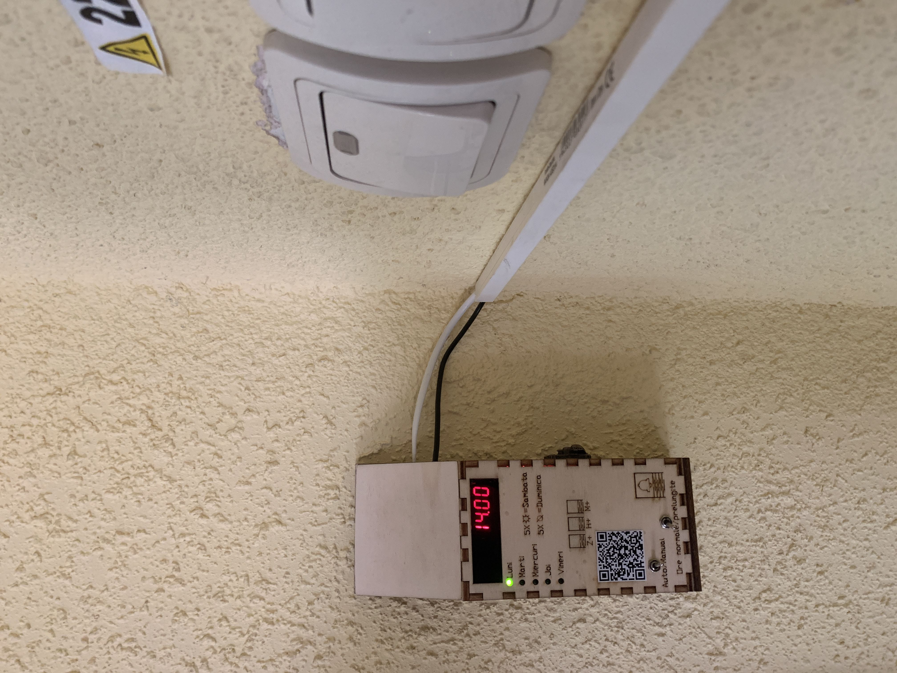
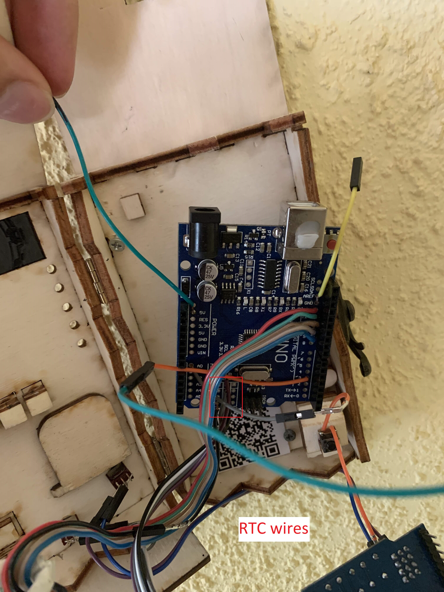
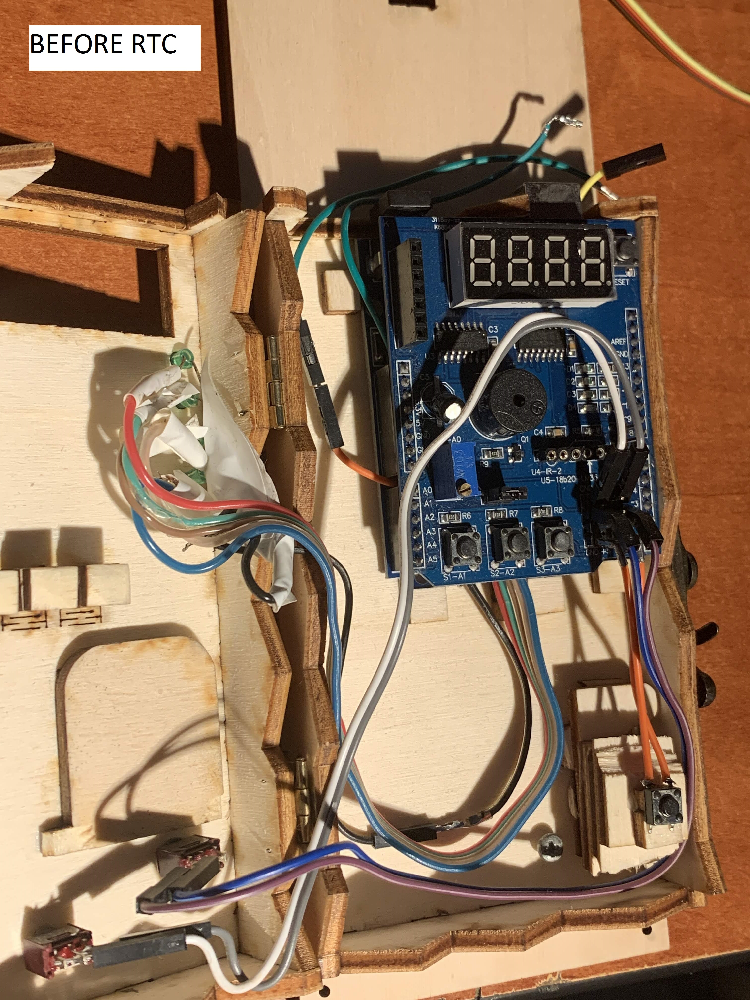

# automatic-school-ringer
hardware:

-arduino uno

-custom* mullie function shield (with a 4 digit display for the time and buttons to set the time & day; * i removed the potentiometer from the shield and used that analog port for something else)

-few buttons and switches (for manual / auto mode - useful for exam days, holydays; normal/long classes, and a button to trigger the bell manually, like you would do with the original trigger)

-leds idicating the day (manually soldered to the arduino, pins 9 -> 13. these pins are used to control the leds on the shield too)

-5V charger was too weak. the clock would freeze from time to time. With a 9V charger it works just fine, no random freezes/bugs so far during a ~6 months period.--

Later update: 0 issues so far. the device has been working for 5 months at the time of writing this update

Photos:

 

